# agent-task-metering

> Track and meter AI agent task intent handling and task adherence.

[](https://github.com/ctava-msft/agent-task-metering/actions/workflows/ci.yml)
[](LICENSE)

## Overview

`agent-task-metering` is a lightweight Python library for evaluating task intent
handling and task adherence produced by AI agents.



## Azure Cost Management

The agent-task-metering service is currently running in **dry-run mode** — it evaluates
tasks and records them in-memory, but does not submit usage events to the Azure
Marketplace Metered Billing API. For charges to appear on an Azure invoice, you would
need to:

1. **Publish a Marketplace offer** in [Partner Center](https://partner.microsoft.com/)
2. **Set `dry_run=False`** on `MarketplaceMeteringClient`
3. **Provide a `submit_callback`** that POSTs to
   `https://marketplaceapi.microsoft.com/api/usageEvent`

## Repository Layout

```
.
├── src/agent_task_metering/   # Library source
├── tests/                     # Unit tests (pytest)
├── docs/                      # Documentation
├── examples/                  # Usage examples
├── .devcontainer/             # VS Code Dev Container config
├── .github/workflows/         # GitHub Actions CI
├── Makefile                   # Developer shortcuts
└── pyproject.toml             # Project metadata and tool config
```

## Quick Start

### Requirements

- Python 3.9+
- Docker (optional, for container build)

### Install

```bash
pip install -e ".[dev]"
```

### Run tests

```bash
make test
```

### Lint

```bash
make lint
```

### Build container image

```bash
make build
```

## Dev Container

Open this repository in VS Code and choose **Reopen in Container** to get a
fully configured Python development environment.

## Example

```python
from agent_task_metering import TaskMeter

meter = TaskMeter()
meter.record("task-001", "my-agent", "chat", input_tokens=512, output_tokens=128)
print(meter.summary())
```

See [`examples/basic_usage.py`](examples/basic_usage.py) for more, or run the
full end-to-end demo:

```bash
python examples/quickstart/run_quickstart.py
```

See [`examples/quickstart/README.md`](examples/quickstart/README.md) for details.

## Documentation

- [Architecture](docs/ARCHITECTURE.md) — how this repo pairs with an Azure Agents Control Plane
- [Billing Dimensions](docs/BILLING_DIMENSIONS.md) — what is billable, hourly aggregation, dispute-resistant semantics
- [Audit Logging](docs/audit-logging.md) — structured logging and billing traceability
- [Marketplace Packaging Checklist](docs/MARKETPLACE_CHECKLIST.md) — steps to publish a Marketplace offer
- [Reuse Documentation](docs/REUSE.md) — which patterns are reused from Microsoft references

## Contributing

This project welcomes contributions and suggestions. Please see
[CODE_OF_CONDUCT.md](CODE_OF_CONDUCT.md) and [SUPPORT.md](SUPPORT.md).

## Security

Please see [SECURITY.md](SECURITY.md) for reporting vulnerabilities.

## License

[MIT](LICENSE) © Microsoft Corporation

This repo reuses metering patterns from Microsoft's
[Metered Billing Accelerator](https://github.com/microsoft/metered-billing-accelerator)
and
[commercial-marketplace-solutions](https://github.com/microsoft/commercial-marketplace-solutions)
reference implementations.
